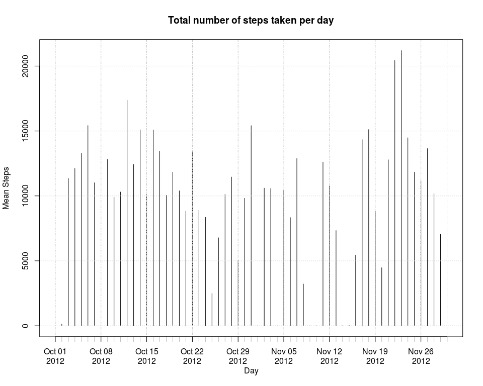
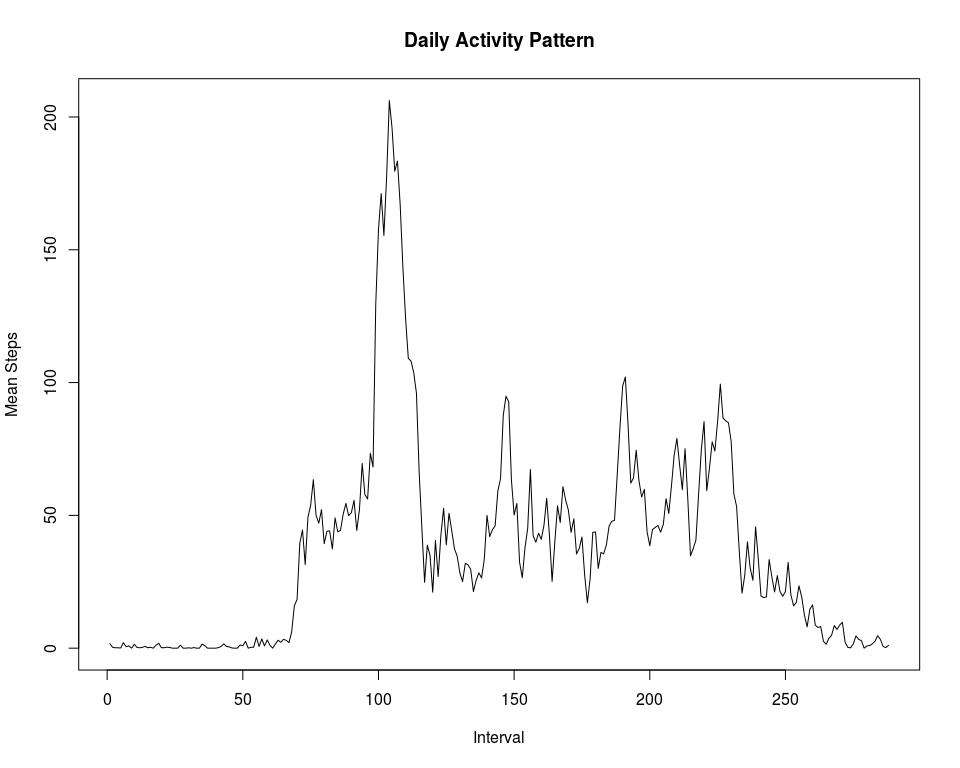
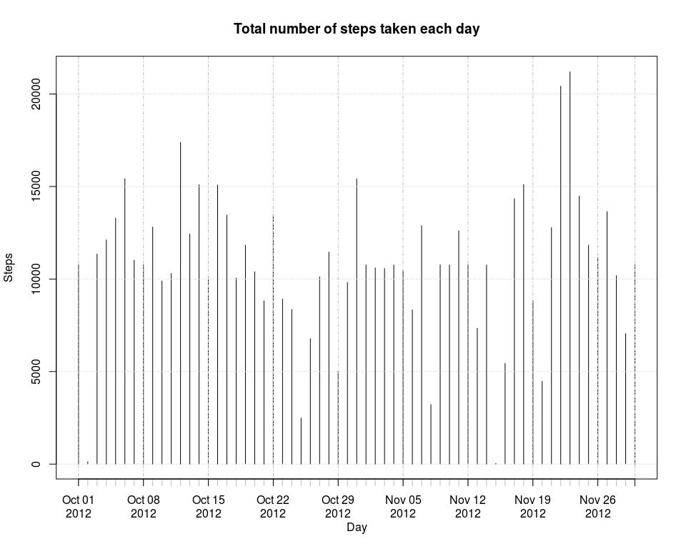
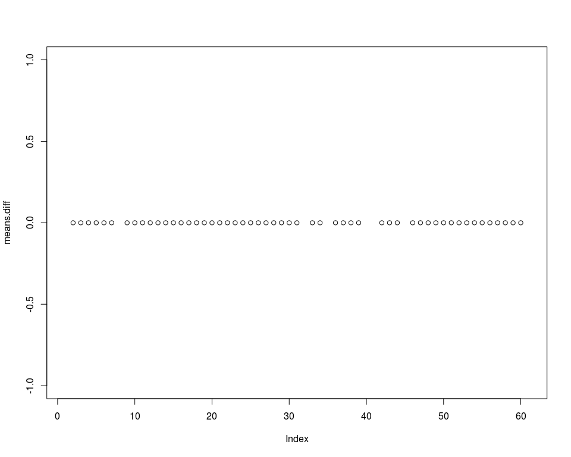

# Reproducible Research: Peer Assessment 1
<!--Comment -->

## Loading and preprocessing the data
First set locale to English for Linux. For other system, see the Sys.setlocale help.
Then, the data is read and a version of complete cases is made.


```r
Sys.setlocale("LC_TIME", "en_US.UTF-8")
```

```
## [1] "en_US.UTF-8"
```

```r
activity <- read.csv("activity.csv")
i_c.act<-complete.cases(activity)
c.act<-activity[i_c.act,]
head(c.act)
```

```
##     steps       date interval
## 289     0 2012-10-02        0
## 290     0 2012-10-02        5
## 291     0 2012-10-02       10
## 292     0 2012-10-02       15
## 293     0 2012-10-02       20
## 294     0 2012-10-02       25
```

I will use a package for times series, xts, lattice for graphs and reshape2 for data transformation

```r
library("xts")
```

```
## Loading required package: zoo
## 
## Attaching package: 'zoo'
## 
## The following objects are masked from 'package:base':
## 
##     as.Date, as.Date.numeric
```

```r
library("lattice")
library("reshape2")
```

## What is mean total number of steps taken per day?
The data is agregated by sum by day and transformed as xts object

```r
t.act<-tapply(activity$steps,activity$date,sum,na.rm=TRUE)
x.act<-xts(t.act,as.Date(names(t.act)))
plot(x.act,type="h", xlab="Day", ylab="Mean Steps", main="Total number of steps taken per day")
```

 
It is possible to calculate the mean and the median for every day

```r
act.means<-tapply(c.act$steps,c.act$date,mean)
act.medians<-tapply(c.act$steps,c.act$date,median)

summary(act.means)
```

```
##    Min. 1st Qu.  Median    Mean 3rd Qu.    Max.    NA's 
##  0.1424 30.7000 37.3800 37.3800 46.1600 73.5900       8
```

```r
summary(act.medians)
```

```
##    Min. 1st Qu.  Median    Mean 3rd Qu.    Max.    NA's 
##       0       0       0       0       0       0       8
```


## What is the average daily activity pattern?
Here we are interested in the distrubition of the steps by the interval

```r
ab.act<-tapply(c.act$steps,c.act$interval,mean)
plot(ab.act, type="l", xlab="Interval", ylab="Mean Steps", main="Daily Activity Pattern")
```

 

The interval with the maximum value was 104 and is 206.1698113  
  
  

## Imputing missing values
Here we fill the NA with the mean or medians of the interval. 
A function will help us: impute.mean
Then some other transformation is needed to get the new picture of the data

```r
impute.mean<-function(data,medians,value=1,index=3)
{
      i_na<-!complete.cases(data)
      for(i in 1:nrow(data))
      {
            if(is.na(data[i,value]))
            {
                  lloc<-data[i,index]
                  nou<-medians[as.character(lloc)]
                  data[i,value]<-nou
            }
                  
      }
      data
            
}

act.imputed<-impute.mean(activity,ab.act)
t.imputed<-tapply(act.imputed$steps,act.imputed$date,sum)
x.imputed<-xts(t.imputed,as.Date(names(t.imputed)))
plot(x.imputed,type="h", xlab="Day", ylab="Steps", main="Total number of steps taken each day")
```

 

```r
act.means0<-tapply(act.imputed$steps,act.imputed$date,mean)
act.medians0<-tapply(act.imputed$steps,act.imputed$date,median)

summary(act.means0)
```

```
##    Min. 1st Qu.  Median    Mean 3rd Qu.    Max. 
##  0.1424 34.0900 37.3800 37.3800 44.4800 73.5900
```

```r
summary(act.medians0)
```

```
##    Min. 1st Qu.  Median    Mean 3rd Qu.    Max. 
##   0.000   0.000   0.000   4.474   0.000  34.110
```
To see the differences between the raw data and the imputed data, we can do some calculations


```r
means.diff<-act.means0-act.means
medians.diff<-act.medians0-act.medians
plot(means.diff)
```

 

```r
plot(medians.diff)
```

 
So, this images show that I have add some day but without altering the previous values.

## Are there differences in activity patterns between weekdays and weekends?
This part is in progress, not finished yet.

```r
act.imputed$day<-weekdays(as.Date(act.imputed$date))

act.imputed$type1<-ifelse(act.imputed$day=="Saturday" | act.imputed$day=="Sunday","weekend","weekday")
act.imputed$type<-factor(act.imputed$type1)
head(act.imputed)
```

```
##       steps       date interval    day   type1    type
## 1 1.7169811 2012-10-01        0 Monday weekday weekday
## 2 0.3396226 2012-10-01        5 Monday weekday weekday
## 3 0.1320755 2012-10-01       10 Monday weekday weekday
## 4 0.1509434 2012-10-01       15 Monday weekday weekday
## 5 0.0754717 2012-10-01       20 Monday weekday weekday
## 6 2.0943396 2012-10-01       25 Monday weekday weekday
```

```r
act.means<-tapply(act.imputed$steps,act.imputed$date,mean)
act.medians<-tapply(act.imputed$steps,act.imputed$date,median)
```
